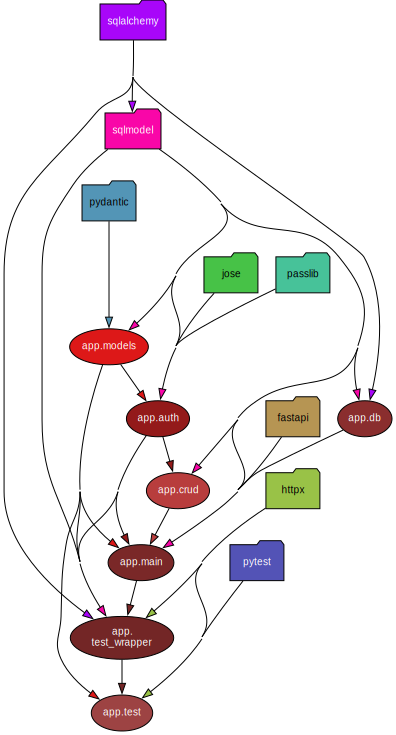

# Multi-Tenant FastAPI + SQLModel + React

Sample FastAPI project that uses async SQLAlchemy, SQLModel, React,
Postgres, Alembic, and Docker.

There is two development modes:
full-fledged docker (postgres) or simple (with sqlite).

## Install

```shell
# install poetry
curl -sSL https://install.python-poetry.org | python3 -

# create SECRET for jwt
cd backend
openssl rand -hex 32 > SECRET_KEY

# install packages
poetry install
```

## Simple Local Development

No docker, no postgres. Just sqlite. Starts on port 8000.

```shell
cd backend
poetry shell
LOCAL_DEV=1 uvicorn app.main:app --reload
```

[DB Browser for Sqlite](https://sqlitebrowser.org) is a tool similar to PGAdmin,
but for sqlite databases.

## Docker (w/Postgres) Development

Runs the fastapi server on port 8004.

```shell
$ docker-compose up -d --build
$ docker-compose exec web alembic upgrade head
```

### Migration

```sh
docker-compose exec web alembic revision --autogenerate
docker-compose exec web alembic upgrade head
```

### PGAdmin

[localhost:8005](http://localhost:8005)

username: postgres@test.com
password: postgres

## Use in IDEs

Open the `backend/` folder in your IDE  
and point the python interpreter to poetry

## Pydeps

Shows dependency graph of the backend

[install graphviz](https://www.graphviz.org/download/)

```shell
poetry shell

# cluster external dependencies (simplifies)
pydeps app --cluster
```

## Architecture



- `db.py` contains functions to start the db and get an async session.
- `models.py` contains the models as SqlModel objects.
  Ideally this would be domain entities, without concerns
  like persistence. It is far simpler to define these in one file,
  at the sacrifice of binding the models to the SQLModel ORM.
  Limiting `models.py` to pydantic models and creating
  `schema.py` or similar for SqlAlchemy divides concerns,
  but is more complicated.
- `auth.py` functions dedicated to authorization and authentication.
  Handles persistence too (potentially too broad in scope).
- `crud.py` generic CRUD functions that are user aware and scope db calls to a user.
  User code does not need to know about handling tokens, users, etc.
- `main.py` brings fastapi in to route everything. Only file to depend on fastapi.
  Bigger projects may break this up into multiple routers.
- `test_wrapper.py` provides an async client wrapper for running tests.
  Async client is user aware, and handles header tokens - just specify the user.
- `test.py` the actual test cases. Uses `wrapper` from `test_wrapper.py`

## Adding Routes / Models

1. add models (copy form of `Song` and `SongBase`) to `models.py`.
   `SongBase` inherits from `SQLModel` and has no table in the database;
   it is unaware of uuids or user ids. Often used for client facing when
   creating, or returning simplified models.
   `Song` inherits from `Owned` and `SongBase`,
   as well as specifying `table=True` to create a table in the database.
   Inheriting `Owned` means it is aware of uuids and user ids.
2. add business logic either directly to `main.py` routes (simple cases) or
   create a new file to hold complex logic. Consider naming it after the model.
   Either way, use the functions in `crud.py` for persistence. If `crud.py` is used,
   the models passed do not need to have `user_id` set, it will set itself from
   the user id of the `token`.
3. add model to `target_metdata` in `backend/migrations/env.py`
4. add test fixtures to `test_wrapper.py`
5. add test to `test.py`

Trick:

```python
song_base: SongBase = SongBase(...)
song: Song = Song(**song_base.dict())

song2: Song = Song(...)
song_base2: SongBase = SongBase(**song2.dict())
```

## Future Stuff

- [mutmut: mutation testing](https://mutmut.readthedocs.io/en/latest/index.html)
- [react-admin](https://marmelab.com/react-admin/)

## References

[FastApi + SqlModel + Alembic](https://github.com/testdrivenio/fastapi-sqlmodel-alembic) - also - [Article](https://testdriven.io/blog/fastapi-sqlmodel/)

[fastapi-react](https://github.com/Buuntu/fastapi-react)

[Full stack fastapi (outdated)](https://github.com/tiangolo/full-stack-fastapi-postgresql)

[python code quality](https://testdriven.io/blog/python-code-quality/)

[python testing](https://testdriven.io/blog/testing-python/)

[Authentication](https://fastapi.tiangolo.com/tutorial/security/oauth2-jwt)

[similar](https://github.com/keyj9/crud-fastapi-sqlmodel-docker-postgresql-reactjs)

[Alembic migrations](https://stackoverflow.com/questions/68932099/how-to-get-alembic-to-recognise-sqlmodel-database-model)

### Poetry

Poetry is used for dependency management. [Full docs here](https://python-poetry.org/docs/cli/), but below is the basics:

```shell
# using environment
poetry shell

# installing
poetry add package-name
poetry add "package-name[extras]"

# installing (dev)
poetry add -G dev package-name

# updating packages
poetry update
```

Note: poetry does not work in a folder with `__init__.py`

### Secrets in files, not environment variables

- use files for secrets instead of environment variables
- environment variables are more prone to leaking
- files can be protected by OS permissions
- [blog post](https://blog.diogomonica.com//2017/03/27/why-you-shouldnt-use-env-variables-for-secret-data/)

### CI Stuff

- CI service?
- https://pre-commit.com/
- https://github.com/pyupio/safety#using-safety-with-a-ci-service

### Usage Info

Helpful random bits of info:

- [Client SDK (typescript)](https://fastapi.tiangolo.com/advanced/generate-clients/)
- [EncryptedType with SqlModel](https://github.com/tiangolo/sqlmodel/issues/447)
